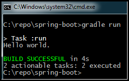
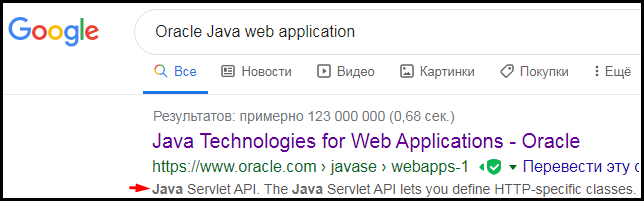
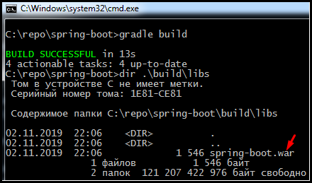
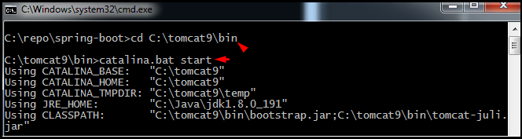
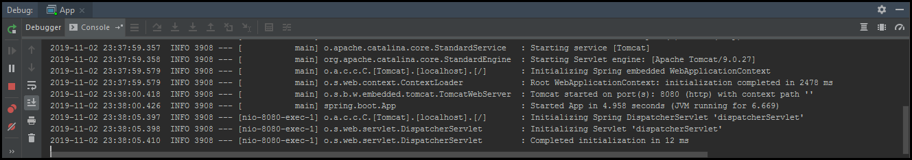
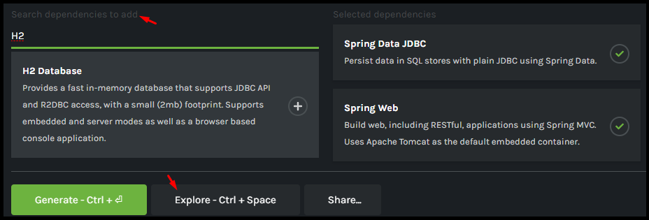
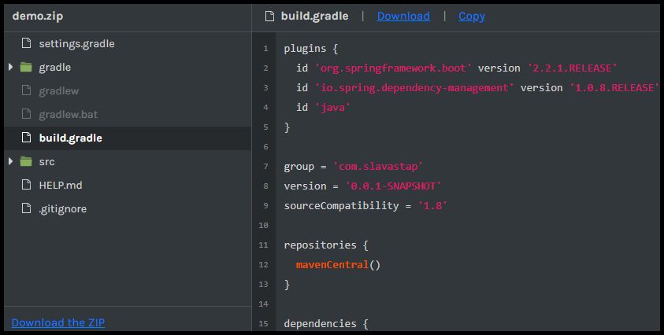

# <a name="Home"></a> Spring Boot

## Table of Content:
- [Java приложение](#java)
- [Web приложение](#web)
- [Spring Boot](#boot)
- [Spring configuration](#configuration)
- [Spring Boot initializr](#initializer)
- [Testing](#testing)
- [Материалы](#links)

## [↑](#Home) <a name="java"></a> Java приложение
Начнём путь нашего Java приложения.
Поможет в этом система автоматической сборки **[Gradle](https://gradle.org/)**.
На сайте Gradle можно перейти в раздел **[Docs](https://docs.gradle.org/current/userguide/userguide.html)** для просмотра документации.
Например, можно прочитать про **[Gradle Plugins](https://docs.gradle.org/current/userguide/plugins.html)** и узнать, что именно они добавляют функциональность. В Gradle есть встренные плагины (которые есть по умолчанию), которые называются **[Core Plugins](https://docs.gradle.org/current/userguide/plugin_reference.html)**.
Один из них, **[Build Init Plugin](https://docs.gradle.org/current/userguide/build_init_plugin.html)**, позволяет создать Gradle проект.
Нажмём **"Win + R"**, выполним **cmd** и выполним создание **[Java Application](https://docs.gradle.org/current/userguide/build_init_plugin.html#sec:java_application)**:
```
gradle init --type java-application
```
На любые выпросы нажимаем Enter, т.к. варианты по умолчанию нам подойдут.
После успешного заверешния у нас появляется полноценное Java приложение.
Кроме этого, появляется файл **build.gradle** - это **Build Script**.

**[Build Script](https://docs.gradle.org/current/userguide/tutorial_using_tasks.html)** - это описатель всего того, что требуется нашему проекту и того, какие задачи можно выполнять для нашего проекта.
Например, в Build Script файле в блоке **plugins** мы видим ```id 'application'```.
Это значит, что для проекта используется плагин [Gradle Application Plugin](https://docs.gradle.org/current/userguide/application_plugin.html). Он добавляет свои собственные [tasks](https://docs.gradle.org/current/userguide/application_plugin.html#sec:application_tasks), например мы можем выполнить задачу **run**:



Таким образом, у нас появилось standalone Java приложение. Оно доступно только локально. Теперь необходимо понять, как сделать данное приложение доступным удалённо, т.е. как его сделать веб-приложением.


## [↑](#Home) <a name="web"></a> Web приложение
Что нужно Java приложению чтобы стать веб-приложением? Можно спросить у гугла:



Основа Web приложение на Java - это **Java Servlet API**.
Servlet API описывается [спецификацией](https://javaee.github.io/servlet-spec/). Например, последняя на текущий момент версия: **"[Java™ Servlet Specification version 4](https://javaee.github.io/servlet-spec/downloads/servlet-4.0/servlet-4_0_FINAL.pdf)"**.

Данная спецификация вводит понятие **Servlet** (**Сервлет**).
**Servlet** - это Web component, который генерирует какой-то динамический контент.
Сервлеты представляют собой скомпилированные Java классы, которые загружаются поддерживающим Javа веб-сервером. Такой веб-сервер для сервлетов служит "контейнером", который управляет сервлетами (они **managed by a container**).
Сервлеты взаимодействуют с клиентом при помощи парадигмы запрос/ответ (request/response), которую и реализует **Servlet Container**.

**Servlet Container** - это часть веб-сервера (или сервера приложений), которая предоставляет сетевые сервисы для обеспечения работы в стиле запрос/ответ. Все сервлет контейнеры должны поддерживать протокол HTTP.
Не менее важная ролль сервлет контейнера - управлять жизненным циклом сервлетов (создавать их и уничтожать).

Одним из самых известных сервлет контейнеров является [Tomcat](http://tomcat.apache.org/).
Для его установки необходимо с офф. сайта из раздела "Download" скачать из "Binary Distributions" версию "Core" zip архивом и распаковать его.

Чтобы наш проект стал веб-приложением необходимо добавить Servlet API в зависимости нашего проекта (т.к. наш проект будет использовать этот API):
```
dependencies {
    providedCompile 'javax.servlet:javax.servlet-api:3.1.0'
    testCompile 'junit:junit:4.12'
}
```
Тут стоит обратить внимание на **providedCompile**. Это означает, что Servlet API не будет частью нашего приложения (т.е. не будет с ним в одном архиве), а будет предоставлен ему кем-то. Как мы можем догадаться, нам его предоставит Servlet Container, т.е. нами установленный Tomcat.

Кроме этого нам нужно собирать проект как веб-приложение. Изменим блок plugins:
```
plugins {
    //Plugin extends the Java plugin to add support for assembling web application
    id 'war'
}
```
Также не забываем убрать **```mainClassName = 'spring.boot.App'```**, т.к. мы больше не используем плагин **Application**.
Теперь Gradle знает, что наше приложение можно собирать как веб-приложение. Осталось только превратить наше приложение в веб-приложение.

Servlet API - это контракт между нашим приложением и сервером. Это означает, что сервер получает request от пользователя и ожидает, что наше приложение определённым образом себя ведёт (имеет определённые методы). Сервер вызывая эти методы передаёт в них данные о запросе и ожидает, что наше приложение определённым образом сформирует response.
По этой причине наш класс теперь должнен быть наследником **HttpServlet**:
```java
import javax.servlet.http.HttpServlet;

public class App extends HttpServlet {
```
Благодаря современной тенденции замены XML конфигурации на Java аннотации, мы можем настроить наш сервлет при помощи Java аннотации:
```java
@WebServlet(name = "HelloServlet", urlPatterns = {"/hello"}, loadOnStartup = 1)
public class App extends HttpServlet {
```
Таким образом, все запросы на /hello будут обрабатываться данным сервлетом.
Так как теперь приложение не самостоятельное, то уберём метод **main**, т.к. точки входа как таковой нет, есть лишь маппинг запросов на методы.
Заменим main метод на метод обработки **HTTP GET** запроса:
```java
@Override
protected void doGet(HttpServletRequest req, HttpServletResponse resp)
	throws ServletException, IOException {
	resp.getWriter().print(getGreeting());
}
```
Как мы видим - мы переопределяем метод **doGet**, т.к. именно этого поведения ждёт от нас сервлет контейнер (т.к. мы согласились на контракт Servlet API).

Не забудем проверить, что все импорты есть:
```
import javax.servlet.ServletException;
import javax.servlet.annotation.WebServlet;
import javax.servlet.http.HttpServlet;
import javax.servlet.http.HttpServletRequest;
import javax.servlet.http.HttpServletResponse;
import java.io.IOException;
```
После этого соберём при помощи Gradle веб-приложение. Выполним **gradle build**:



Как мы помним, веб-приложение не может работать самостоятельно, а должно быть запущено на веб-сервере, который может быть сервлет контейнером.
Ранее мы распаковали сервлет контейнер Tomcat. Теперь необходимо добавить наше веб-приложение в контейнер. Для этого поместим наш "**.war**" архив в подкаталог "**webapps**" каталога томката.

Далее остаётся только запустить сервер.
Перейдём для этого в подкаталог **bin** и выполним **catalina.bat start**:



Теперь мы сможем открыть наше веб-приложение по следующему URL:
``` http://127.0.0.1:8080/spring-boot/hello ```
spring-boot - название нашего веб-приложение (war файл), а hello мы указали в pattern.
Это - самый простейший способ создать веб-приложение с использованием Servlet API. Самый простейший, но как-то сложно. Хочется, чтобы не надо было устанавливать сервер приложений. Хочется запускать как обычное приложение. Хочется, чтобы при этом всё это поддерживалось из IDE без особых усилий. При этом не хочется самому писать логику запуска и обслуживания сервера приложений.
Наступил момент и эти желания реализовали товарищи из компании Pivotal.
Их проект называется - **[Spring Boot](https://spring.io/projects/spring-boot)**.


## [↑](#Home) <a name="boot"></a> Spring Boot приложение
**Spring Boot** позволяет писать веб-приложения на Java так, чтобы оно представляло собой standalone приложение, которое само будет запускать сервер и ухаживать за ним, снимая лишнюю головную боль с нас.
Чтобы разобраться в Spring Boot нам поможет раздел **[Spring Boot Learn](https://spring.io/projects/spring-boot#learn)**.
В разделе Spring Boot Learn нас интересует **"[Reference Documetation](https://docs.spring.io/spring-boot/docs/current/reference/html/)"**.
В документации нас интересует раздел "**[Getting Started](https://docs.spring.io/spring-boot/docs/current/reference/html/getting-started.html#getting-started)**".
Из раздела "**[3. Installing Spring Boot](https://docs.spring.io/spring-boot/docs/current/reference/html/getting-started.html#getting-started-installing-spring-boot)**" мы доходим до документа **"[Spring Boot Gradle Plugin Reference Guide](https://docs.spring.io/spring-boot/docs/current/gradle-plugin/reference/html/)"**.

Таким образом, начала нашего Build Script'а должно выглядеть следующим образом:
```
plugins {
	id 'org.springframework.boot' version '2.2.0.RELEASE'
}
apply plugin: 'java'
apply plugin: 'io.spring.dependency-management'
```

Далее нам нужно добавить функциональность из Spring Framework. Добавляется она при помощи так называемых **стартеров**. При подключении стартер добавляет в проект зависимости и конфигурации по умолчанию.
Например, чтобы добавить поддержку веба в наше приложение необходимо добавить стартер "**spring-boot-starter-web**":
```
dependencies {
	implementation 'org.springframework.boot:spring-boot-starter-web'
    testCompile 'junit:junit:4.12'
}
```
Согласно документации (см. **"[1. SpringApplication](https://docs.spring.io/spring-boot/docs/current/reference/html/spring-boot-features.html#boot-features-spring-application)"**) изменим наш Java код, чтобы он стал кодом Spring Boot приложения:
```java
import org.springframework.boot.SpringApplication;
import org.springframework.boot.autoconfigure.SpringBootApplication;

@SpringBootApplication
public class App {
    public String getGreeting() {
        return "Hello world.";
    }
    public static void main(String[] args) {
        SpringApplication.run(App.class, args);
    }
}
```
Но теперь у нас нет никого, кто бы отвечал на запрос к серверу.
Опишем маппинг HTTP реквеста на наш метод:
```java
@GetMapping("/hello")
@ResponseBody
public String getGreeting() {
	return "Hello world.";
}
```
Данные аннотации являются аннотациями **Spring WebMVC** (см. "**[Request Mapping](https://docs.spring.io/spring/docs/current/spring-framework-reference/web.html#mvc-ann-requestmapping)**"). Spring MVC у нас появился благодаря стартеру **spring-boot-starter-web**.

Но чтобы у нас заработал маппинг необходимо активировать **Spring WebMVC**.
Для этого нам нужно указать аннотацию "**[@EnableWebMvc](https://docs.spring.io/spring/docs/current/spring-framework-reference/web.html#mvc-config-enable)**". Указывать её надо у конфигурации (конфигурации помечаются в Spring аннотацией @Configuration). Если посмотреть, что такое аннотация **SpringBootApplication**, то мы увидим, что она включает в себя много других аннотаций, в том числе - **@SpringBootConfiguration**, которая включает в себя необходимую нам **@Configuration**.
Кроме того, аннотация "[@GetMapping](https://docs.spring.io/spring/docs/current/spring-framework-reference/web.html#mvc-ann-requestmapping)" будет работать только тогда, когда она находится в классе **Spring контроллера**, поэтому аннотируем ещё и как "**[@Controller](https://docs.spring.io/spring/docs/current/spring-framework-reference/web.html#mvc-controller)**".
Таким образом, наш класс будет выглядеть следующим образом:
```java
@SpringBootApplication
@EnableWebMvc
@Controller
public class App {
```
Дело за малым - запустить сервер. Достаточно выполнить main метод:



Теперь наше приложение доступно по адресу ``http://127.0.0.1:8080/hello``.


## [↑](#Home) <a name="configuration"></a> Spring Boot configuration
Итак, у нас есть веб-приложение с использованием Spring Boot. Как же его можно конфигурировать?
Представим, что у нас есть задача подключить к проекту базу данных.
Во-первых, нам нужна сама база данных в зависимостях нашего проекта.
Например, мы можем выбрать базу данных "**[H2](https://www.h2database.com/html/cheatSheet.html)**":
```
dependencies {
	implementation 'org.springframework.boot:spring-boot-starter-web'
	implementation 'com.h2database:h2:1.4.200'
    testCompile 'junit:junit:4.12'
}
```

Но мир баз данных и мир Java - два разных мира. Их надо как-то подружить, чтобы Java научилась обращаться в БД, а БД смогла возвращать ответ Java приложению. И для этого в Java есть **JDBC** - **Java Database connectivity**. Чтобы добавить его поддержку, нам нужно подключить нужный "**[Spring Boot starter](https://docs.spring.io/spring-boot/docs/current/reference/html/using-spring-boot.html#using-boot-starter)**".
Для JDBC нужно подключить **spring-boot-starter-jdbc**:
```
dependencies {
	implementation 'org.springframework.boot:spring-boot-starter-web'
	implementation 'org.springframework.boot:spring-boot-starter-jdbc'
```
Ранее мы поняли, что каждый стартер добавляет как нужные библиотеки, так и настройки по умолчанию. Но мы можем повлиять на настройки Spring Boot.

Чтобы влиять на настройки Spring Boot существует конфигурационный файл **application.properties**, подробнее про который можно прочитать в разделе "**[Common Application properties](https://docs.spring.io/spring-boot/docs/current/reference/html/appendix-application-properties.html#common-application-properties)**". Создадим его в корне нашего проекта.
Из списка по ссылке выше мы можем выбрать настройки источника данных (Datasource).
Сами настройки возьмём из "[H2 cheat sheet](https://www.h2database.com/html/cheatSheet.html)":
```
spring.datasource.driver-class-name=org.h2.Driver
spring.datasource.url=jdbc:h2:mem:test
spring.datasource.username=sa
spring.datasource.password=sa
```
Теперь мы можем описать Datasource для нашего проекта. Например, создадим класс:
```java
@Configuration
public class DataSourceConfig {
    @Bean
    public DataSource dataSource() {
        return new EmbeddedDatabaseBuilder()
                .setType(EmbeddedDatabaseType.H2)
                .setName("example")
                .build();
    }
}
```
Теперь нужно эту конфигурацию включить в нашу Spring Boot конфигурацию:
```java
@Import(DataSourceConfig.class)
public class App {
```
Кроме того, нужно привязать Datasource так, чтобы о том, где находится DataSource заботился сам Spring:
```java
@Import(DataSourceConfig.class)
public class App {
    @Autowired
    private DataSource dataSource;
```
Кроме того, нам может понадобится сконфигурировать начальное состояние БД.
Для этого по умолчанию установлена настройка **spring.datasource.initialization-mode=always**. Это позволяет в каталоге **src/main/resources** создать схему и наполнить её данными.
Создадим файл **src/main/resources/schema.sql**:
```sql
CREATE TABLE messages (
  id   INTEGER PRIMARY KEY,
  text VARCHAR(64) NOT NULL);
```
Далее создадим наполнение **src/main/resources/data.sql**:
```sql
INSERT INTO messages (id, text) VALUES (1, 'Hello, world');
```
Остаётся только доработать наш метод:
```java
@GetMapping("/hello")
@ResponseBody
public String getGreeting() {
	try(Statement statement = dataSource.getConnection().createStatement()) {
		String query = "SELECT text FROM messages WHERE id = 1";
		ResultSet resultSet = statement.executeQuery(query);
		resultSet.next();
		return resultSet.getString("text");
	} catch (SQLException e) {
		e.printStackTrace();
		return null;
	}
}
```
Кроме этого в конфигурировании может помочь **"[Properties with Spring and Spring Boot](https://www.baeldung.com/properties-with-spring)"**.


## [↑](#Home) <a name="initializer"></a> Spring Boot initializr
Ранее нам приходилось настраивать Spring Boot приложение вручную. Можно ли и это упростить? Да, можно. И помочь в этом призван "[Spring Initializr](https://start.spring.io)".
Он позволяет через веб-интерфейс сконфигурировать проект, набрав нужные зависимости:



Интересно, что прямо на сайте можно посмотреть, как будет выглядеть проект. Например, можно подсмотреть, как настроить проект Gradle, если это хочется сделать самому:



Но это ещё не всё. Можно обойтись вовсе без веб-страницы, используя "[Spring Boot CLI](https://docs.spring.io/spring-boot/docs/current/reference/htmlsingle/#cli)".

Кроме того, мы можем получить проект используя утилиту curl (для ОС Windows её можно взять **[отсюда](https://curl.haxx.se/windows/)**).
Подробное описание процесса генерации через curl можно найти на официальном github, в разделе **"[Generating a project](https://github.com/spring-io/initializr#generating-a-project)"**.


## [↑](#Home) <a name="testing"></a> Тестирование и Spring Boot
Говоря о Spring Boot хочется затронуть тему тестирования. Естественно, создатели Spring не могли обойти стороной и эту тему.

Прежде всего, необходимо подключить Spring boot стартер:
```
testCompile 'org.springframework.boot:spring-boot-starter-test'
```

Пример того, как может выглядеть тест, можно увидеть в официальных tutorial'ах от Spring. Например, в этом: **"[Testing the Web Layer](https://spring.io/guides/gs/testing-web/)"**.

Таким образом, тест, который бы запустил Spring Boot и проверил наш код в самом простейшем случае мог бы выглядеть следующим образом:
```java
@RunWith(SpringRunner.class)
@SpringBootTest
public class AppTest {

    @Autowired
    private App controller;

    @Test
    public void testAppHasAGreeting() {
        assertNotNull(controller);
        assertThat(controller.getGreeting(), Matchers.equalTo("Hello, world"));
    }
}
```


## [↑](#Home) <a name="links"></a> Материалы
Spring Boot - многогранная тема. Далее приведены матеалы, котороые могу стать отправной точкой для понимания того, что такое Spring Boot.
- [Евгений Борисов — Spring – Глубоко и не очень](https://www.youtube.com/watch?v=nGfeSo52_8A)
- [Максим Гореликов, Кирилл Толкачев — Spring Boot Starter — как и зачем?](https://www.youtube.com/watch?v=2_iE7jZWl3U)
- [Евгений Борисов, Кирилл Толкачев — Boot yourself, Spring is coming (Часть 1)](https://www.youtube.com/watch?v=UYre4_bytD4&t=2s)
- [Евгений Борисов, Кирилл Толкачев — Boot yourself, Spring is coming (Часть 2)](https://www.youtube.com/watch?v=wQcZK0Tln30)
- [Кирилл Толкачёв — Тестируем и плачем вместе со Spring Boot Test](https://www.youtube.com/watch?v=uc-cfX-5wQA)
- [Евгений Борисов, Кирилл Толкачев — Проклятие Spring Test](https://www.youtube.com/watch?v=7mZqJShu_3c)
- [Spring Boot: интеграционное тестирование с Spring Testing](https://www.youtube.com/watch?v=Lnc3o8cCwZY)
- [Spring Boot: модульное тестирование и подмена (mock object)](https://www.youtube.com/watch?v=QrSR1fm9JwA)
- [Spring Patterns (Evgeny Borisov, Israel)](https://www.youtube.com/watch?v=zLFgvdHUlA0)
- [Coursera: Building Cloud Services with the Java Spring Framework](https://www.coursera.org/learn/cloud-services-java-spring-framework)
- [Apache Kafka and Spring Boot (Consumer, Producer)](https://www.udemy.com/course/apache-kafka-and-spring-boot-consumer-producer/)
- [Udemy: Introducing Spring Boot](https://www.udemy.com/course/spring-boot-getting-started/)
- [Udemy: Learn Spring Boot the Easy Way!](https://www.udemy.com/course/spring-boot-tutorial-beginners/)
- [Udemy: Spring Core - Learn Spring Framework 4 and Spring Boot](https://www.udemy.com/course/spring-core/)
- [Hamcrest Tutorial](http://hamcrest.org/JavaHamcrest/tutorial)